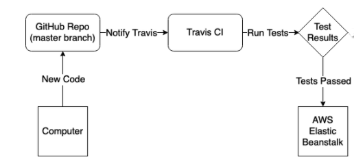

# Spring PetClinic Sample Application [](https://travis-ci.org/github/natalia-k/spring-petclinic)

## More details about the Spring Petclinic in the [original repo](https://github.com/spring-projects/spring-petclinic)

## Deployment Workflow
A representation of the deployment workflow is as follows:



Whenever we push some new code to our repository, it will notify Travis CI. 
Travis CI will then run the tests.
If all tests pass, Travis CI will then proceed with deploying the project on AWS. 
In case of a failure, Travis will stop and notify about the crash.

The deployment process has four steps:
- Setting-up Repository on GitHub.
- Configuring Travis CI for Testing.
- Setting-up AWS Elastic Beanstalk.
- Configuring Travis CI for Deployment.

## Running petclinic in a Docker Container locally
```
git clone https://github.com/natalia-k/spring-petclinic.git
cd spring-petclinic
docker build -t spring-petclinic .
docker run  -p 8080:8080 spring-petclinic
```
## Running petclinic locally
Petclinic is a [Spring Boot](https://spring.io/guides/gs/spring-boot) application built using [Maven](https://spring.io/guides/gs/maven/). You can build a jar file and run it from the command line:

```
git clone https://github.com/spring-projects/spring-petclinic.git
cd spring-petclinic
./mvnw package
java -jar target/*.jar
```

You can then access petclinic here: http://localhost:8080/

